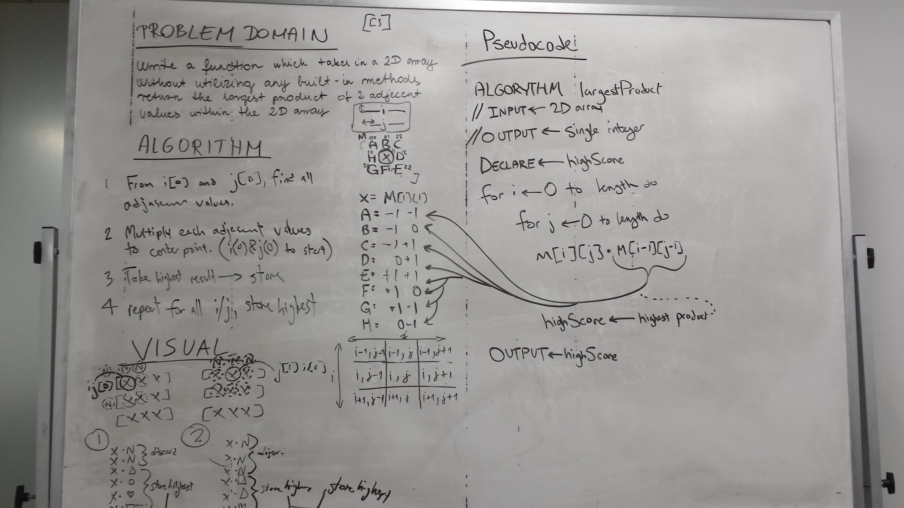

## Challenge
Write a function called LargestProduct which takes in a 2D array. Without utilizing any of the built-in methods available to your language, return the largest product of 2 adjacent values within the 2D array.

Example:
[ 
    [ 1, 2, 1 ], 
    [ 2, 4, 2 ], 
    [ 3, 6, 8 ], 
    [ 7, 8, 1 ] 
  ]
Output: 64

## Solution

## Credits
Collobrated with the class.

    
    