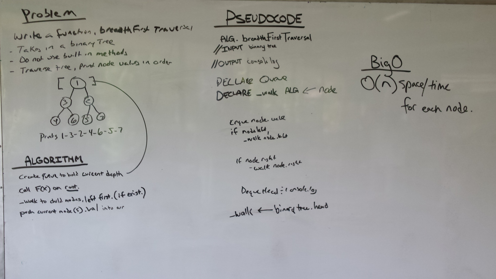

# Breadth First Traversal

## Challenge

Write a function called breadthFirstTraversal which takes a Binary Tree as its unique input. Without utilizing any of the built-in methods available to your language, traverse the input tree using a Breadth-first approach; print every visited node’s value.

## Solution

## Credits
Worked with: Jason and various class members

Resources Consulted: Google