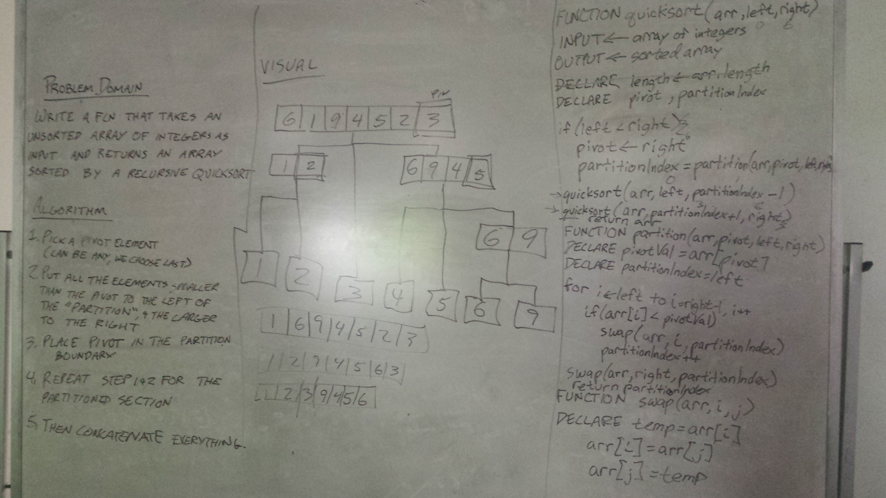

## QuickSort

## Challenge

Write a function that accepts an array of integers, and returns an array sorted by a recursive quicksort algorithm.

Example:

Input	
[34, 19, 42, -9, 2018, 0, 2005, 77, 2099]	

Output
[-9, 0, 19, 34, 42, 77, 2005, 2018, 2099]

## Solution

## Credits
Worked with: Ben Hurst

Resources Consulted: None